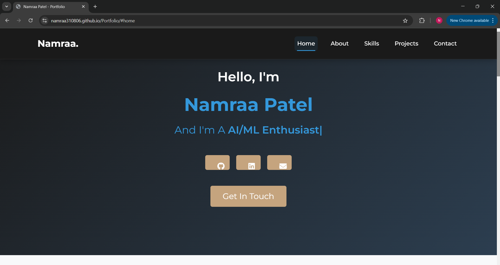
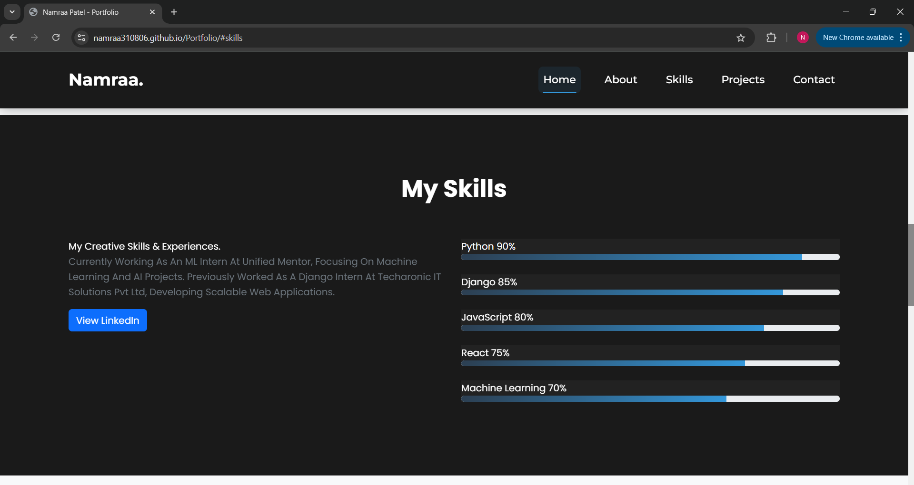

# Namraa Patel - Portfolio Website

A modern, responsive portfolio website showcasing my skills, projects, and professional experience as a Full Stack Developer and AI/ML Enthusiast.

## 🌐 Live Demo
Visit my portfolio at: [https://namraa310806.github.io/Portfolio/](https://namraa310806.github.io/Portfolio/)

## 🚀 Features

- **Responsive Design**: Fully responsive layout that works on all devices
- **Modern UI**: Clean and professional design with smooth animations
- **Interactive Elements**: 
  - Project cards with flip animation
  - Skill progress bars
  - Smooth scrolling navigation
  - Contact form
- **Performance Optimized**: Fast loading and smooth transitions

## 📸 Screenshots

### Desktop View

*Home section with responsive design*

### Mobile View

*Mobile-optimized layout*

### Projects Section

*Interactive project cards with flip animation*

### Skills Section

*Skills showcase with progress bars*

## 🛠️ Technologies Used

- HTML5
- CSS3 (with custom animations and transitions)
- JavaScript
- Bootstrap 5
- Font Awesome Icons
- Google Fonts

## 📋 Sections

1. **Home**: Introduction and quick overview
2. **About**: Detailed professional background and experience
3. **Skills**: Technical skills with progress indicators
4. **Projects**: Showcase of major projects with detailed descriptions
5. **Contact**: Contact form and professional information

## 🎯 Key Projects Showcased

1. **Django Job Portal**
   - Full-featured job search and recruitment platform
   - Built with Django, Python, and SQLite

2. **Color Detection**
   - Real-time color detection using computer vision
   - Implemented with Python, OpenCV2, and Streamlit

3. **Student Management System**
   - Web-based student information management platform
   - Developed using PHP, MySQL, and JavaScript

## 🔧 Setup and Installation

1. Clone the repository:
   ```bash
   git clone https://github.com/Namraa310806/Portfolio.git
   ```

2. Open `index.html` in your browser to view the website locally

## 📱 Responsive Design

The website is fully responsive and optimized for:
- Desktop computers
- Tablets
- Mobile phones

## 🤝 Contact

- **Name**: Namraa Patel
- **Email**: patelnamraa88@gmail.com
- **Location**: Jivraj Park, Ahmedabad
- **LinkedIn**: [View LinkedIn Profile](https://www.linkedin.com/in/namraa-patel-310806/)

## 📄 License

This project is open source and available under the [MIT License](LICENSE).

---

© 2024 Namraa Patel. All rights reserved.
